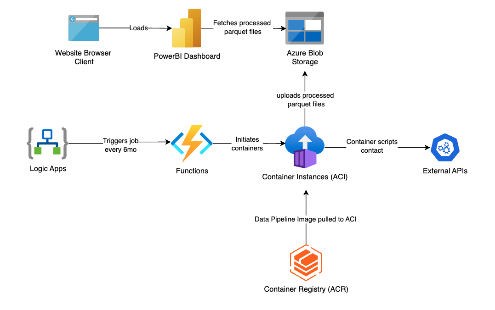
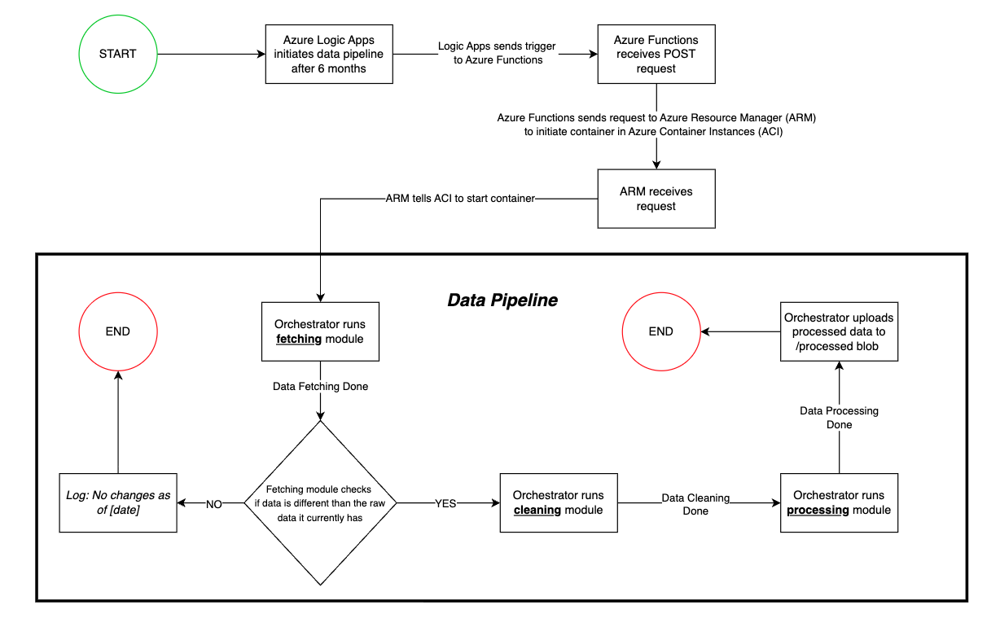

# PlanCatalyst Data Dashboard

We're building an interactive dashboard for [PlanCatalyst](https://www.PlanCatalyst.org)’s redesigned website that forecasts country-level development progress on:
* __UN SDGs__ (United Nations Sustainable Development Goals) – Human Rights & Gender Equity
* __ND-GAIN__ (Notre Dame Global Adaptation Index) – Climate Change Resilience
* __World Bank Data__ – Financial Capacity

We are exploring ML **regression** techniques using scikit-learn to forecast country-level development and NumPy to construct **composite indexes**. **Azure** automates the data pipeline, while **Microsoft Power BI** delivers the interactive frontend.

## ☁️ Azure Architecture
***The Azure architecture of this project is still being designed & developed.***


## 📊 Data Pipeline Flow Diagram


## 🏙️ Code Structure
***The structure of this project is still being designed.***
```
PC-DATA-DASH/
├── .vscode/
├── azure/                            # All Azure-specific code
│   ├── functions/                    # Azure Function (triggers container)
│   │   ├── __init__.py
│   │   ├── function_app.py           # HTTP trigger function code
│   │   ├── requirements.txt          # azure-mgmt-containerinstance, azure-identity
│   │   └── README.md                 # Manual deployment instructions
│   │
│   └── logic_apps/                   # Logic Apps workflow
│       ├── pipeline-scheduler.json   # Export from Azure Portal (for reference)
│       └── README.md                 # Manual deployment instructions
│
├── data/                             # LOCAL ONLY - for development/testing
│   ├── external/                     # Static data (ND-GAIN ZIP)
│   │   └── nd_gain_countryindex_2025.zip
│   ├── interim/                      # Temp storage during local dev
│   │   ├── ndgain/
│   │   ├── unsdg/
│   │   └── worldbank/
│   ├── processed/                    # Local output for testing
│   └── raw/                          # Local raw fetches for testing
│
├── notebooks/                        # For testing models
│   ├── EDA_un_sdg.ipynb
│   └── EDA_world_bank.ipynb
│
├── src/                              # DEPLOYABLE CODE (Containerized)
│   ├── __init__.py
│   │
│   ├── config/
│   │   ├── __init__.py
│   │   ├── settings.yaml             # Pipeline configuration
│   │   └── config.py                 # Config loader class
│   │
│   ├── fetch/                        # 1. Data fetching module
│   │   ├── __init__.py
│   │   ├── base_fetch.py             # DataClient interface
│   │   ├── client_factory.py         # DataClientFactory
│   │   ├── un_sdg_fetch.py           # UNSDGClient
│   │   ├── nd_gain_fetch.py          # NDGAINClient
│   │   ├── world_bank_fetch.py       # WorldBankClient
│   │   └── README.md
│   │
│   ├── clean/                        # 2. Data cleaning module
│   │   ├── __init__.py
│   │   ├── base_clean.py             # DataCleaner interface
│   │   ├── cleaner_factory.py        # DataCleanerFactory
│   │   ├── clean_un_sdg.py           # UNSDGCleaner
│   │   ├── clean_nd_gain.py          # NDGAINCleaner
│   │   └── clean_world_bank.py       # WorldBankCleaner
│   │
│   ├── processing/                   # 3. Data processing & ML
│   │   ├── __init__.py
│   │   ├── processor.py              # DataProcessor (transform, merge)
│   │   ├── validator.py              # DataValidator
│   │   └── ml_models.py              # ML processing (if applicable)
│   │
│   ├── storage/                      # Azure Blob Storage operations
│   │   ├── __init__.py
│   │   ├── blob_storage.py           # BlobStorage class (upload/download)
│   │   └── utils.py                  # Storage helpers
│   │
│   ├── orchestrator/                 # Pipeline orchestration
│   │   ├── __init__.py
│   │   ├── orchestrator.py           # DataOrchestrator class
│   │   └── main.py                   # CONTAINER ENTRY POINT
│   │
│   └── utils/                        # Shared utilities
│       ├── __init__.py
│       ├── logger.py                 # Azure Monitor logging
│       └── helpers.py                # Common functions
│
├── container/                        # Docker setup
│   ├── Dockerfile                    # Container image definition
│   ├── requirements.txt
│   ├── .dockerignore
│   └── README.md
│
├── infrastructure/                   # Infrastructure as Code
│   ├── bicep/                        # Azure Bicep templates (alt: Terraform)
│   │   ├── main.bicep                # Main deployment
│   │   ├── storage.bicep             # Blob Storage
│   │   ├── container-registry.bicep  # ACR
│   │   ├── function.bicep            # Azure Function
│   │   └── logic-app.bicep           # Logic Apps
│   │
│   └── terraform/                    # (alt: Terraform)
│       └── (optional)
│
├── deployment/                       # Deployment scripts
│   ├── build-container.sh            # Build Docker image
│   ├── push-to-acr.sh                # Push to Azure Container Registry
│   ├── deploy-function.sh            # Deploy Azure Function
│   └── setup-infrastructure.sh       # Run Bicep/Terraform deployment
│
├── powerbi/                          # Power BI connection info
│   ├── blob-connection.md            # How to connect Power BI to Blob Storage
│   └── example-queries.pq            # Power Query examples
│
├── .env.example                      # Environment variables template
├── .gitignore
├── requirements.txt
├── README.md
└── LICENSE
```

## 📌 References/Resources
### UN SDGs
* [UN SDG **API** V1](https://unstats.un.org/sdgapi/swagger/#!/)
* [UN SDG **API** V5](https://unstats.un.org/sdgs/UNSDGAPIV5/swagger/index.html) 
* [UN Statistics Division](https://unstats.un.org/UNSDWebsite/#) – **Gateway** to UN SDG data
  * Provides lots of background on the goals, indicators, methodology, statistics, etc.
* [UN SDG Data Commons](https://unstats.un.org/UNSDWebsite/undatacommons/sdgs) – **Resource** that shows SDG progress by goal, indicator, and country
  * Can be used to preview API request for a given query
  * Features interactive maps (good reference)
* [UN SDG Indicators Home](https://unstats.un.org/sdgs/) – **Gateway** to UN SDG data resources
  * Provides background on lots of SDG information as well 
* [UN SDG Data Portal](https://unstats.un.org/sdgs/dataportal) – **Database** of all indicator data
### ND-GAIN Index
* [ND-GAIN CSV](https://gain.nd.edu/our-work/country-index/download-data/) – Official University of Notre Dame source for downloading the latest ND-GAIN Country Index in CSV format
* [ND-GAIN Technical Report](https://gain.nd.edu/assets/522870/nd_gain_countryindextechreport_2023_01.pdf)
* [ND-GAIN Indicators](https://gain.nd.edu/assets/522870/nd_gain_countryindextechreport_2023_01.pdf)
### World Bank Group
* [World Bank Open Data](https://data.worldbank.org/) – Repo of global development & economic indicators
  * Features an interactive map (good reference)
* [World Bank DataBank](https://databank.worldbank.org/home.aspx) – Browser tool; helps define API parameters to use before making API calls
* [API V2 Documentation](https://datahelpdesk.worldbank.org/knowledgebase/articles/889392-about-the-indicators-api-documentation?utm_source=chatgpt.com) – API Guide
* [World Bank API Documentation](https://documents.worldbank.org/en/publication/documents-reports/api) – API guide

## 🌐 Team
This dashboard is made by __[Tech for Social Impact](https://www.uwotsi.com) (TSI)__.

* __Project Managers__: Thomas Llamzon, Anthony Lam
* __Developers__: Adeline Lue Sang, Caroline Shen, Christina Wong, Kayden Jaffer, Tyler Asai
