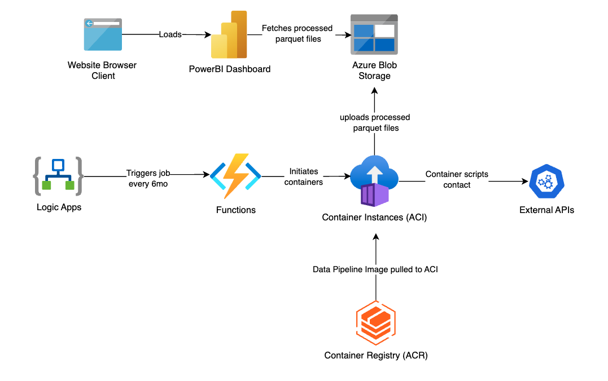
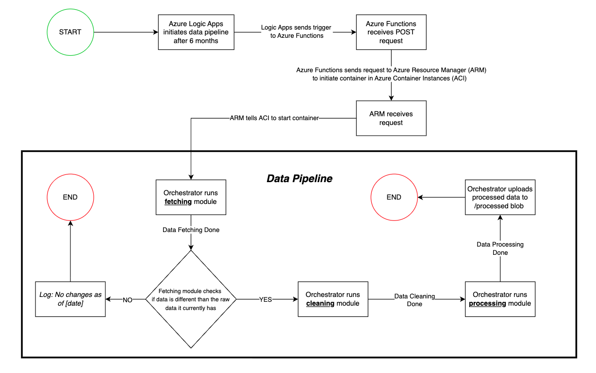

# PlanCatalyst Data Dashboard

We're building an interactive dashboard for [PlanCatalyst](https://www.PlanCatalyst.org)’s redesigned website that forecasts country-level development progress on:
* __UN SDGs__ (United Nations Sustainable Development Goals) – Human Rights & Gender Equity
* __ND-GAIN__ (Notre Dame Global Adaptation Index) – Climate Change Resilience
* __World Bank Data__ – Financial Capacity

We are exploring ML **regression** techniques using scikit-learn to forecast country-level development and NumPy to construct **composite indexes**. **Azure** automates the data pipeline, while **Microsoft Power BI** delivers the interactive frontend.

## About PlanCatalyst
PlanCatalyst is a subsidiary of [Plan International Canada](https://plan-international.org/) (a major international humanitarian and development organization) that provides consulting services in international development, corporate sustainability, and social investment. PlanCatalyst provides consultancy services for topics such as disaster reduction, humanitarian relief, gender equality, education, health, and economic empowerment. The organization maximizes the impact of social investments and ESG initiative by leveraging the extensive field experience of Plan International Canada. It operates in tandem with Plan International Canada, which is a recognized humanitarian organization that responds to emergencies (such as food crises, conflicts, and natural disasters) with a focus on children and girls. 

PlanCatalyst acts as a specialized arm for providing strategic, technical, and evaluation expertise to maximize the global impact Plan International Canada makes.

## ☁️ Azure Architecture
***The Azure architecture of this project is still being designed & developed.***


## 📊 Data Pipeline Flow Diagram


## 🏙️ Code Structure
```
PC-DATA-DASH/
├── .vscode/                          # VS Code configuration
│
├── data/                             # Data storage
│   ├── external/                     # Static external data
│   │   └── nd_gain_countryindex_2025.zip
│   │
│   ├── processed/                    # Indicator progress projections (actuals + forecasts)
│   │   └── worldbank/...
│   │
│   ├── interim/
│   │   ├── cleaned/                  # Cleaned interim CSVs (after fetch → clean)
│   │   │   ├── nd_gain_interim.csv
│   │   │   ├── un_sdg_interim.csv
│   │   │   └── world_bank_interim.csv
│   │   └── validated/                # Scoring outputs (src/calculating)
│   │       ├── Indicator_Scores_Full.csv
│   │       ├── domainscores.csv
│   │       ├── sectorscores.csv
│   │       ├── subsectorscores.csv
│   │       └── indicatorscores/
│   └── raw/                          # Raw fetched data
│       ├── nd_gain_raw.csv
│       ├── un_sdg_raw.json
│       └── world_bank_raw.json
│
├── notebooks/                        # Jupyter notebooks (empty - for future EDA)
│
├── src/                              # Source code
│   ├── README.md                     # Source code overview
│   │
│   ├── config/
│   │   └── settings.yaml             # Pipeline configuration
│   │
│   ├── fetch/                        # Data fetching module
│   │   ├── README.md                 # Fetching documentation
│   │   ├── FETCHING.png              # Fetching flow diagram
│   │   ├── base_fetch.py             # Base fetcher interface
│   │   ├── fetch_factory.py          # Fetcher factory pattern
│   │   ├── fetch_data.py             # Main fetch orchestrator
│   │   ├── un_sdg_fetch.py           # UN SDG API client
│   │   ├── nd_gain_fetch.py          # ND-GAIN data fetcher
│   │   ├── world_bank_fetch.py       # World Bank API client
│   │   └── .env                      # Environment variables (gitignored)
│   │
│   ├── clean/                        # Data cleaning module
│   │   ├── README.md                 # Cleaning documentation
│   │   ├── CLEANING.png              # Cleaning flow diagram
│   │   ├── base_clean.py             # Base cleaner interface
│   │   ├── clean_factory.py          # Cleaner factory pattern
│   │   ├── clean_data.py             # Main cleaning orchestrator
│   │   ├── un_sdg_clean.py           # UN SDG data cleaner
│   │   ├── nd_gain_clean.py          # ND-GAIN data cleaner
│   │   └── world_bank_clean.py       # World Bank data cleaner
│   │
│   ├── pipeline/                     # Pipeline orchestration
│   │   ├── README.md                 # Pipeline documentation
│   │   ├── ORCHESTRATOR.png          # Orchestrator flow diagram
│   │   ├── orchestrator.py           # Main orchestrator class
│   │   ├── run_pipeline.py           # Pipeline entry point
│   │   ├── terminal_output.py        # Terminal output utilities
│   │   └── utils.py                  # Pipeline helper functions
│   │
│   └── processing/                   # Data processing & ML (in development)
│       ├── README.md                 # Processing documentation
│       ├── regression.py             # Regression models
│       └── forecasting.py            # Forecasting utilities
│
├── venv/                             # Python virtual environment (gitignored)
│
├── .env                              # Environment variables (gitignored)
├── .gitignore                        # Git ignore rules
├── requirements.txt                  # Python dependencies
├── Azure-Arch.png                    # Azure architecture diagram
├── Data-Flow.png                     # Data pipeline flow diagram
└── README.md                         # This file
```

## 📌 References/Resources
### UN SDGs
* [UN SDG **API** V1](https://unstats.un.org/sdgapi/swagger/#!/)
* [UN SDG **API** V5](https://unstats.un.org/sdgs/UNSDGAPIV5/swagger/index.html) 
* [UN Statistics Division](https://unstats.un.org/UNSDWebsite/#) – **Gateway** to UN SDG data
  * Provides lots of background on the goals, indicators, methodology, statistics, etc.
* [UN SDG Data Commons](https://unstats.un.org/UNSDWebsite/undatacommons/sdgs) – **Resource** that shows SDG progress by goal, indicator, and country
  * Can be used to preview API request for a given query
  * Features interactive maps (good reference)
* [UN SDG Indicators Home](https://unstats.un.org/sdgs/) – **Gateway** to UN SDG data resources
  * Provides background on lots of SDG information as well 
* [UN SDG Data Portal](https://unstats.un.org/sdgs/dataportal) – **Database** of all indicator data
### ND-GAIN Index
* [ND-GAIN CSV](https://gain.nd.edu/our-work/country-index/download-data/) – Official University of Notre Dame source for downloading the latest ND-GAIN Country Index in CSV format
* [ND-GAIN Technical Report](https://gain.nd.edu/assets/522870/nd_gain_countryindextechreport_2023_01.pdf)
* [ND-GAIN Indicators](https://gain.nd.edu/assets/522870/nd_gain_countryindextechreport_2023_01.pdf)
### World Bank Group
* [World Bank Open Data](https://data.worldbank.org/) – Repo of global development & economic indicators
  * Features an interactive map (good reference)
* [World Bank DataBank](https://databank.worldbank.org/home.aspx) – Browser tool; helps define API parameters to use before making API calls
* [API V2 Documentation](https://datahelpdesk.worldbank.org/knowledgebase/articles/889392-about-the-indicators-api-documentation?utm_source=chatgpt.com) – API Guide
* [World Bank API Documentation](https://documents.worldbank.org/en/publication/documents-reports/api) – API guide

## 🌐 Team
This dashboard is made by __[Tech for Social Impact](https://www.uwotsi.com) (TSI)__.

* __Project Managers__: Thomas Llamzon, Anthony Lam
* __Developers__: Adeline Lue Sang, Caroline Shen, Christina Wong, Kayden Jaffer, Tyler Asai
