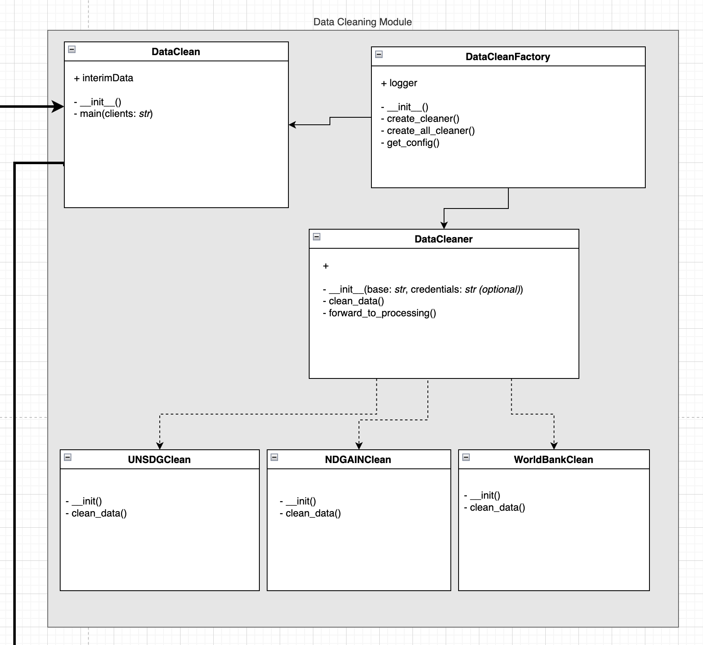

# Data Cleaning Module

## Overview
This module is responsible for cleaning the raw data from the World Bank, UN SDG, and ND-GAIN fetching clients.

Each fetching client returns a list of records, which are then cleaned and returned as a single dataframe by the corresponding cleaner object.

This module implements the abstract factory pattern to create the appropriate cleaner objects based on the source of the data, as well as to allow for easy extension of the module to support additional sources in the future.

## Class Diagram
