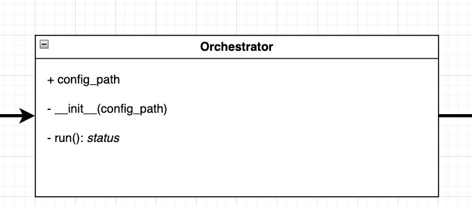

# Data Pipeline Orchestration

## Overview
This module is responsible for orchestrating the data pipeline.

It runs 3 major modules in sequence:
1. **Fetch** – Fetching and structuring the data from the various sources.
2. **Clean** – Cleaning and uploading the cleaned data to Azure Blob Storage.
3. **Process** – Creating projections based on the cleaned data, and uploading them in Azure Blob Storage.

These are the 3 major steps in the **data pipeline**. After the data pipeline is complete, the processed data is then visualized using Power BI.

## Running the code

To run the data pipeline, use the following command:
```zsh
python3 -m src.pipeline.run_pipeline
```

To debug the pipeline directly in VS Code, create a file at `.vscode/launch.json` and paste the following configuration:
```json
{
    "version": "0.2.0",
    "configurations": [
        {
            "name": "Debug: Run Pipeline",
            "type": "debugpy",
            "request": "launch",
            "module": "src.pipeline.run_pipeline",
            "console": "integratedTerminal",
            "cwd": "${workspaceFolder}",
            "env": {
                "PYTHONPATH": "${workspaceFolder}"
            },
            "justMyCode": false
        },
        {
            "name": "Python: Current File",
            "type": "debugpy",
            "request": "launch",
            "program": "${file}",
            "console": "integratedTerminal",
            "cwd": "${workspaceFolder}",
            "env": {
                "PYTHONPATH": "${workspaceFolder}"
            },
            "justMyCode": true
        }
    ]
}
```

## Class Diagram


(really the only relevant class)
