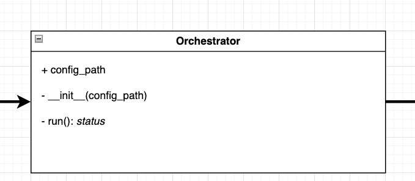

# Data Pipeline Orchestration

## Overview
This module is responsible for orchestrating the data pipeline.

It runs the pipeline in sequence, including:
1. **Fetch** – Fetch and structure data from each source.
2. **Clean** – Write cleaned interim CSVs under `data/interim/cleaned/`.
3. **Calculating** – Score indicators and write `data/interim/validated/`.
4. **Upload** – Push validated scoring outputs to Azure for Power BI.
5. **Process** – Build **projections of indicator progress** (actuals + forecast rows) under `data/processed/`, and optionally upload those blobs.

After a run, Power BI typically consumes **validated** scores from Blob; **processed** holds projection series (e.g. World Bank actuals/forecasts) for forward-looking views.

## Running the code

To run the data pipeline, use the following command:
```zsh
python3 -m src.pipeline.run_pipeline
```

To debug the pipeline directly in VS Code, create a file at `.vscode/launch.json` and paste the following configuration:
```json
{
    "version": "0.2.0",
    "configurations": [
        {
            "name": "Debug: Run Pipeline",
            "type": "debugpy",
            "request": "launch",
            "module": "src.pipeline.run_pipeline",
            "console": "integratedTerminal",
            "cwd": "${workspaceFolder}",
            "env": {
                "PYTHONPATH": "${workspaceFolder}"
            },
            "justMyCode": false
        },
        {
            "name": "Python: Current File",
            "type": "debugpy",
            "request": "launch",
            "program": "${file}",
            "console": "integratedTerminal",
            "cwd": "${workspaceFolder}",
            "env": {
                "PYTHONPATH": "${workspaceFolder}"
            },
            "justMyCode": true
        }
    ]
}
```

## Class Diagram


(really the only relevant class)
